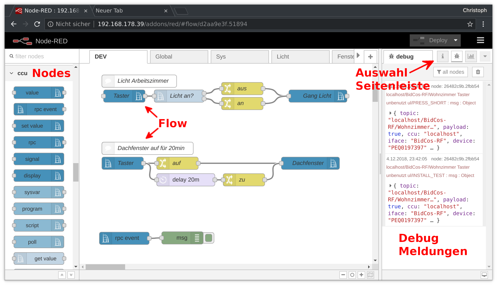
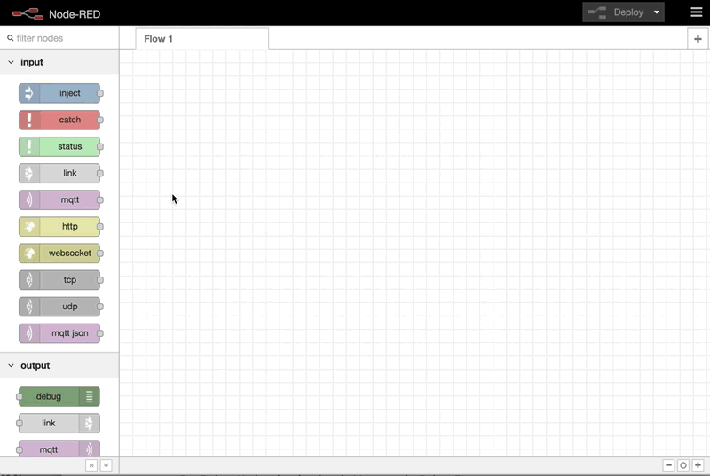

# Node-RED

> Node-RED is a programming tool for wiring together hardware devices, APIs and online services in new and interesting ways.  
  It provides a browser-based editor that makes it easy to wire together flows using the wide range of nodes in the palette that can be deployed to its runtime in a single-click.

## Editor

Der Flow Editor von Node-RED ist nicht sonderlich kompliziert. Auf der linken Seite sind die installierten Nodes aufgelistet.
In der Mitte werden die einzelnen Flows designed, darüber die Flow-Tabs die zur Kategorisierung dienen. Die rechte Seitenleiste
ist wiederum in Tabs aufgeteilt um verschiedene Ansichten auszuwählen. Das Bild zeigt das Debug-Panel was Ausgaben aus `debug`
Nodes anzeigt. Wichtig sind auch die _Node information_ die nützliche Hilfestellungen der aktuell ausgewählten Node anzeigen.

Um Flows zu erstellen werden die Nodes per drag & drop in den Editor gezogen. Sie werden durch _Wires_ miteinander verbunden
indem man einen Verbindungspunkt anklickt, die Maustate gedrückt hält und den Verbindungspunkt der Ziel-Node auswählt.

::: tip
 Mit `Strg-click` öffnet sich ein Autocompleter-Widget um eine neue Node an der Mausposition einzufügen. 
::: 

## Deployment

Wenn ein Flow fertig gestellt ist muss er deployed, also aktiv geschaltet werden. Hierzu dient der `Deploy` Button
in der oberen rechten Ecke des Editors. Nach einem Deployment werden die Änderungen übernommen und live geschaltet.

Es gibt verschiedene Arten des Deployments:

* **Full**  
  Deployed _alle_ Flows. Gleicht einem Neustart von Node-RED und initiiert
  Flows deren Input Node _Beim Start letzten bekannten Wert ausgeben_ gewählt haben.
  Bei häufiger Anwendung kann sich dies negativ auf den DutyCycle der CCU auswirken.
   
* **Modified Flows**  
  Deployed alle Flows aus allen geänderten Flow-Tabs.

* **Modified Nodes**  
  Es werden nur veränderte Nodes deployed. Diese Option sollte während der Entwicklung verwendet werden.

## Weitere Dokumentation

* [Node-RED Website](https://nodered.org/)
* [Node RED Programming Guide](http://noderedguide.com/)
