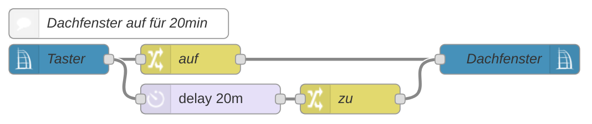
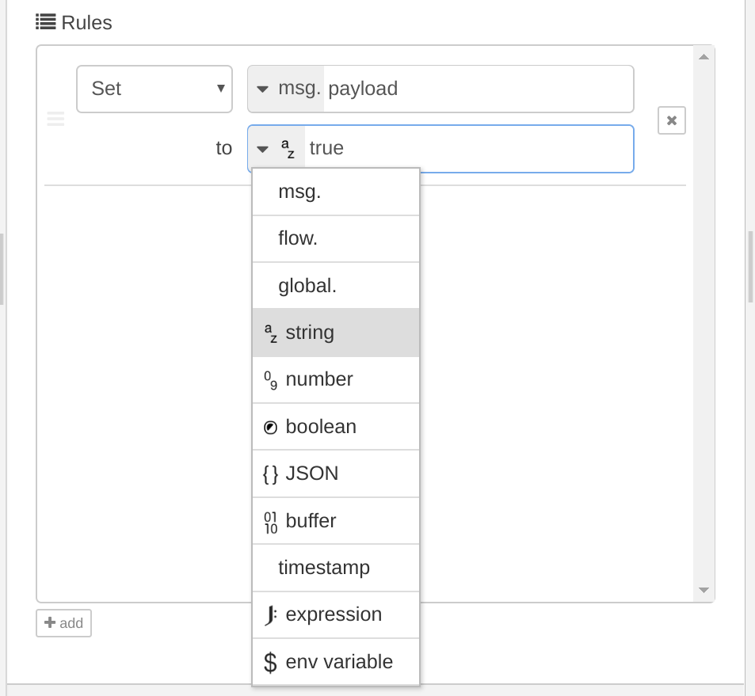

# Flows

Ein Flow ist das Zusammenspiel von einem `Input` Event bis hin zu einer `Output` Aktion.

Das eintreffende Event startet eine Kette von Modifikationen, Prüfungen oder Verzögerungen was zu einem Ergebnis führt.
Dies wird an eine `Output` Node übergeben welche z.B. einen Aktor schaltet oder eine E-Mail verschickt.

Zwischen den einzelnen Nodes wird das Event anhand eines `msg` Objekts übergeben. Es besitzt, je nach Event, verschiedene Properties.
Eine Konvention von Node-RED sieht `msg.payload` als den Wert vor, der den Zustand/Wert angibt, also z.B. true/false für an/aus.

Die Properties von `msg` sind in Datentypen eingeteilt wie _boolena_, _number_, _string_ oder _JSON_.

## Input Nodes

Input Nodes starten einen Flow. Das kann aus verschiedensten Gründen notwendig sein. Zum Beispiel zu einer bestimmten
Uhrzeit, wenn ein Taster gedrückt wird, wenn eine Temperatur überschritten wird und noch aus vielen weiteren anderen Gründen.

Jede Node die einen Verbindungspunkt auf der rechten Seite hat und auf ein externes Ereignis reagiert kann einen Flow starten.
Meist kann man aus dem Info-Panel die nötigen Daten ablesen um das Event weiter zu verarbeiten.

## Modification Nodes

Sie dienen zur Steuerung des Flow-Verhaltens und legen z.B. den Unterschied zwischen ein- oder ausschalten einer Lampe fest.
Zudem können sie auch genutzt werden um den Flow vorzeitig zu beenden wenn beispielsweise am Tag kein Licht durch einen
Bewegungsmelder angeschaltet werden soll. Einige Nodes haben mehrere Outputs an denen der Flow fortgesetzt werden kann.
Zum Beispiel kann `Output 1` genutzt werden um eine Lampe EIN und `Output 2` um die selbe Lampe AUS zu schalten,
je nachdem ob die Lampe gerade an oder aus ist.

## Output Nodes

Eine Output Node bewegt ein externes System dazu den Zustand zu ändern. Man erkennt sie neben dem Namen daran, dass
sie auf der linken Seite einen Verbindungspunkt haben, oft aber nicht auf der rechten Seite. Ein Output kann das Schalten
eines Homematic Aktors sein, eine Telegram Nachricht oder E-Mail aber auch die Zustandsänderung eines Dashboard-Widgets.

## Subflows

Node-RED unterstützt das Konzept von Subflows. Ein Subflow ist die Kapselung von verschiedenen Nodes und daraus
eine wiederverwendbare eigene Node zu erstellen. Dies ist sehr nützlich wenn oft die selben Nodes in Flows 
verwendet werden. Wie auch jede andere Node kann ein Subflow einen einzigen Input haben und verschiedene Outputs.
