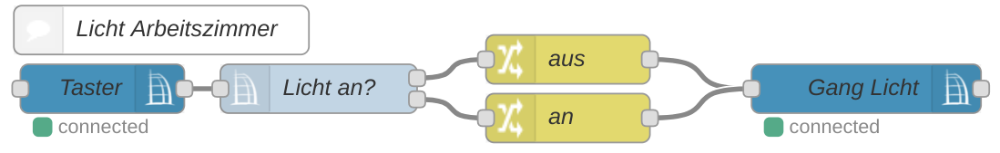
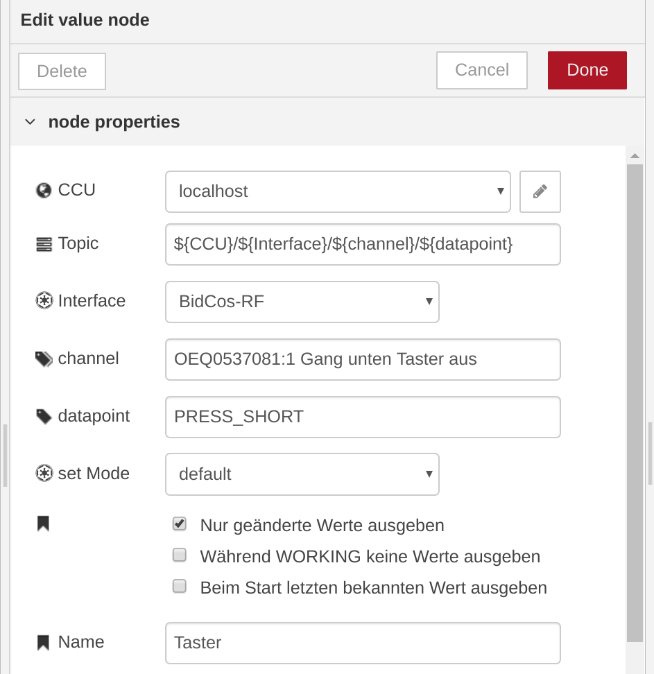
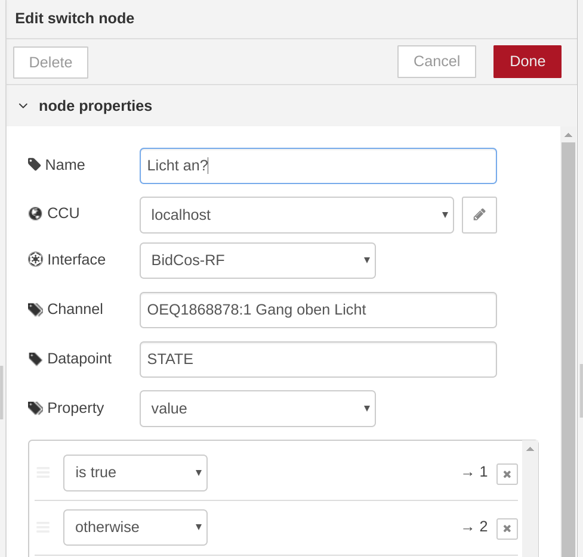
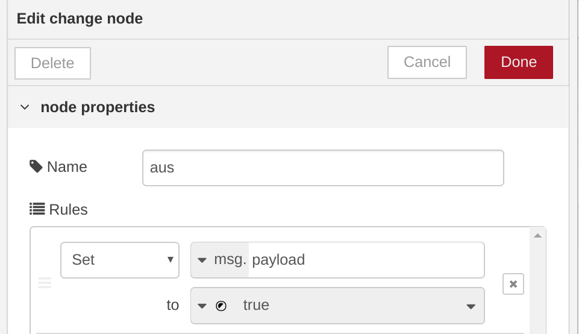
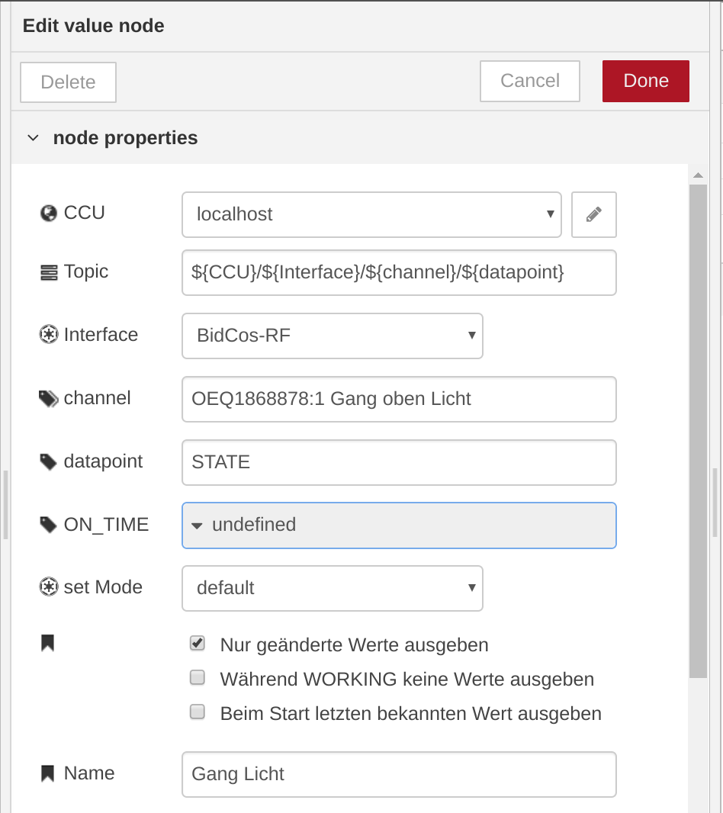

# Beispiele

## Licht schalten

Zur besseren Übersicht ist oben zuerst eine `comment` Node mit der Beschriftung "Licht Arbeitszimmer" eingefügt.  

Als Input Node kommt die [ccu value Node](/nodes/ccu/value.html) zum Einsatz. Sie kann sowohl einzelne Datenpunke
lesen als auch schreiben, je nachdem ob sie am Anfang oder am Ende eines Flows positioniert wird.  
In diesem Beispiel soll das Licht über einen Homematic Wandtaster geschaltet werden weshalb als _Interface_ `BidCos-RF`
in den Node Einstellungen gewählt wird. Der Channel und der Datapoint legen den Wert fest auf den reagiert werden soll.
Ein gültiger Channel könnte `OEQ0537081:1 Gang unten Taster` sein. Je nach gewähltem Kanal stehen verschiedene Datenpunkte
zur Verüfung. Im Falle eines Tasters z.B. `PRESS_SHORT`, `PRESS_LONG` oder `PRESS_CONT`. Letzteres ist ein Event was
bei dauerhaftem Druck immer wieder erzeugt wird.

Da wir den selben Taster zum ein- und ausschalten nutzen wollen müssen wir den Zustand des Aktors je nach aktuellem
Zustand setzen. Aus diesem Grund wird nun der Zustand abgefragt und je nach Wert wird der Flow an `Output 1` oder `Output 2`
fortgesetzt. Hierzu kann die [ccu switch Node](/nodes/ccu/switch.html) verwendet werden. Der aktuelle Zustand eines
Schaltaktors steht im Datenpunkt `STATE` und dem Property `value`. Zu einem Datenpunkt gibt es weitere Properties 
wie z.B. den Zeitstempel der letzten Änderung.

Nachdem jetzt bekannt ist ob die Lampe an oder aus ist wird der Zustand, genauer `msg.payload` invertiert.
Dazu kann eine `change` Node verwendet werden. Sie setzt beliebige Properties von `msg` auf einen neuen Wert.
Entsprechend den Ausgängen der `ccu switch` Node kann hier `true` bzw `false` gesetzt werden.

Zuletzt wird das Event `msg` an die Output Node übergeben wofür wieder die [ccu value Node](/nodes/ccu/value.html)
verwendet werden kann.

Um den Flow aktiv zu schalten wird er zum Schluß deployed.

::: tip
Die `debug` Node eignet sich sehr gut um die Werte eines Events zu analysieren.  
Im Debug-Tab in der Seitenleiste wird die debug-`msg` dargestellt.
:::

