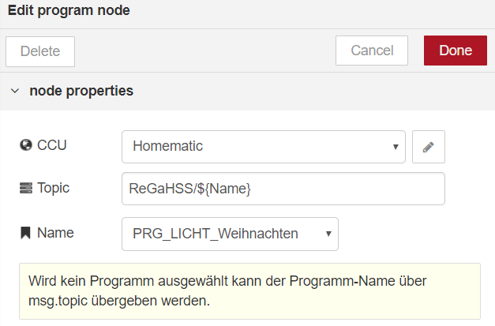

# program

ReGaHSS-Programme starten, aktivieren oder deaktivieren. Gibt den Zeitpunkt der letzten Programmausführung aus.

## Input

Ist `msg.payload` vom Typ `boolean` wird das Programm bei `true` aktiviert und ausgeführt und bei `false` deaktiviert.

In allen anderen Fällen (Payload ist z.B. `exec`) wird das Programm ausgeführt.

## Output

Im Payload ist der Zeitstempel der letzten Programmausführung (Attribut `ts`) sowie die Information ob ein Programm aktiv oder inaktiv ist (Attribut `active`) enthalten.

## Attribute

### CCU

Unter CCU wird die zu verwendende CCU-Konfiguration angegeben.

### Topic

Der Wert von `msg.topic` für den Output der Node.

### Name

Der Name des ReGaHSS Programms.
Wird kein Programm ausgewählt kann der Programm-Name über `msg.topic` übergeben werden.