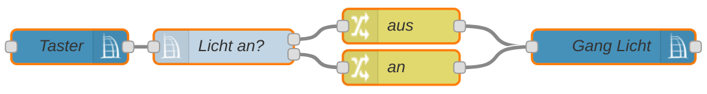

# switch

Die `ccu switch` Node verhält sich ähnlich wie die [switch](https://nodered.org/docs/user-guide/nodes#switch) Node von Node-RED. Sie führt einen Flow auf einem von mehreren Outputs fort, abhängig von einem Zustand eines Aktors oder einer Systemvariablen. 

Beispiel: Ein Tastendruck initiiert den Flow. Ist von Kanal `Gang Licht` der Datenpunkt `STATE` gleich `true` (also Licht ist an), fahre an Output 1 fort, ansonsten Output 2. An Output 1 hängt eine eine [change](https://nodered.org/docs/user-guide/nodes#change) Node welche die Payload auf `false` ändert. An Output 2 eine `change` Node die den Payload auf `true` ändert. Beide Nodes sind mit einer [value](value.html) Node verbunden welche den `STATE` vom Kanal `Gang Licht` setzt. Nun hat man einen Taster geschaffen welcher das Licht im Gang aus bzw. ein schaltet.

## Attribute

### Name

Der Name dient zur Beschriftung des Node im Flow.

### CCU

Die zu verwendende CCU-Konfiguration.

### Interface

Hier wird das Interface gewählt, welches das Event erzeugt hat.

### Channel

Der Kanal von dem der Datenpunkte abgefragt werden solln.  
Eine Autovervollständigung hilft bei der Auswahl anhand der Klarnamen.

### Datapoint

Der Datenpunkt des Kanals, auch hier wird über eine Autovervollständigung die Auswahl vereinfacht.

### Property

Hier wird das spezifische Property des Datenpunkts ausgewählt:

* `value`: Der reale Wert
* `ts`: Der aktuelle Timestamp
* `lc`: Der Timestamp der letzten Aktualisierung
* `working`: Gibt an, ob sich der Aktor gerade im Schaltvorgang befindet
* `direction`: Gibt die Richtung an in der sich z.B. ein Rollladen im Moment bewegt

### Regeln

Für jeden Output wird Bedingung definiert.

Der Operator (z.B. `==` oder `<=`) gibt die Art des Vergleichs an. Je nach Operator wird daneben der Vergleichswert gewählt. Er kann aus verschiedenen Quellen kommen, zum Beispiel über Eingabe als String oder Number, aus einem anderen Property von `msg`, aus einem [Context](https://nodered.org/docs/user-guide/context) und weiteren.

Es können beliebig viele Rules und damit Outputs angelegt werden.

Verahlten des Matchers:
* `checking all rules`: Es werden Events an allen Outputs erzeugt, an denen der Vergleich zutrifft
* `stopping after first match`: Der erste zutreffende Vergleich erzeugt ein Event, es werden keine weiteren Prüfungen durchlaufen.
