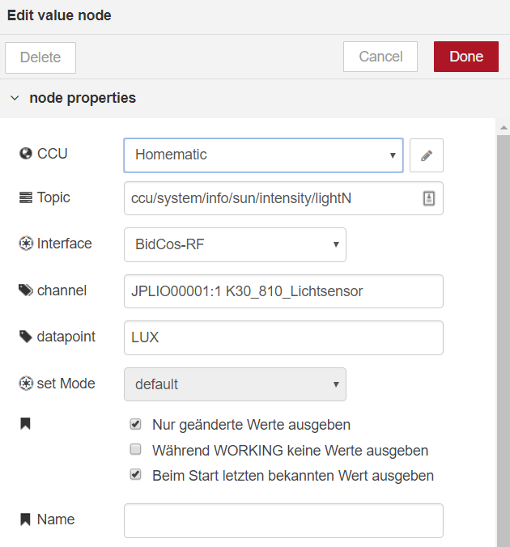

# value

Die `value` Node kann Datenpunkte setzen _und_ erzeugt Events wenn vom Schnittstellenprozess ein den Datenpunkt
betreffendes Ereignis eingeht.

Beispiel: Wird die `value` Node am Anfang platziert, startet sie den Flow wenn z.B. ein Schaltaktor den Zustand ändert. Wird die Node ans Ende positioniert kann sie den Zustand des Schaltaktors setzen.



## Attribute

### CCU

Die zu verwendende CCU-Konfiguration.

### Topic

Das Topic ist an [MQTT](https://de.wikipedia.org/wiki/MQTT) angelehnt und dient zu späteren
Identifizierung des Werts.

### Interface

Hier wird das Interface gewählt, welches den gewünschten Datenpunkt enthält.

### Channel

Der Kanal dessen Datenpunkte verwendet werden solln.
Er besteht aus der Serien- sowie der Kanalnummer.
Eine Autovervollständigung hilft bei der Auswahl anhand der Klarnamen.

### Datapoint

Der Datenpunkt des Kanals, auch hier wird über eine Autovervollständigung die Auswahl vereinfacht.

### ON_TIME

Zeit in Sekunden nach der ein Schaltaktor/Dimmer nach dem anschalten wieder ausgeschaltet werden soll.

Dabei ist:
* `undefined`: Keine automatische Ausschaltung
* `number`: Eine feste Verzögerung in Sekunden
* `global`, `flow`: Eine Verzögerung aus einer Context-Variablen
* `msg`: Eine Verzögerung aus einem `msg`-Property.

### set Mode

Eine Erweiterung für Geräte, die sowohl den rx_mode BURST als auch
WAKEUP unterstützen wie z.B.: Batterie-Schaltaktoren oder Rauchmelder mit Sirenenfunktion.
Mit dem Parameter kann in diesem Fall angegeben werden,
ob der übergebene Wert über BURST oder WAKEUP übertragen werden soll.

* WAKEUP: Überträgt den Wert sobald der entsprechende Empfänger aufacht.
* BURST: Versucht alle BURST-Empfänger für die Übertragung aufzuwecken was sich
  negativ auf den DutyCycle und die Batterielaufzeit aller Burst-Empfänger auswirkt.

### Flags

 * ***Nur geänderte Werte ausgeben***
   Ein Event wird nur dann erzeugt, wenn sich der Wert seit dem letztn Event verändert hat.

 * ***Während WORKING keine Werte ausgeben***
   Es gibt Aktoren, z.B. Dimmer oder Rolladen, die  während einer Rampe (Öffnen/Schließen eines Rollladen, Dimmen einer Lampe)
   fortwährend den aktuellen Zustand ausgeben. Um nur den End-Status auszugeben kann diese Option benutzt werden.
   Gebräuchlich auch bei Verwendung mit Dashboard-Nodes um "springende" Slider zu verhindern.

 * ***Beim Start letzten bekannten Wert ausgeben***
   Wenn Node-RED gestartet wird, dann wird der letzte Wert (sofern in der ReGaHSS bekannt) ausgegeben.
   Z.B. um beim Start einen korrekten Wert an das Dashboard zu übergeben.
   **Achtung**: Wird durch die ausgegebene Nachricht im weiteren Verlauf des Flows ein Homematic Wert gesetzt wirkt sich
   jedes (Full-)Deployment negativ auf den DutyCycle aus.


### Name

Der Name dient zur Beschriftung des Node im Flow.

## Input

Für den Input des Value Node wird `msg.payload` als der Wert verwendet der in den Datenpunkt geschrieben wird.

Die Bestimmung des Datenpunkts sowie des Kanals und der Schnittstellen können hier dynamisch
sein. Dazu werden die entsprechenden Node-Attribute leer gelassen und über `msg` gesetzt.

**Option 1:**
Interface, Channel und Datapoint können in der `msg` als Properties angegeben werden:

```json
{
  "interface": "BidCos-RF",
  "channel": "OEQ1868878:1",
  "datapoint": "STATE",
  "payload": true
}
```

**Option 2:**
Der Datenpunkt kann über `msg.topic` angegeben werden wobei die Werte mit Punkt getrennt werden:
```json
{
  "topic": "BidCos-RF.OEQ1868878:1.STATE",
  "payload": true
}
```

## Output

Der Value Node gibt nur Events aus, wenn Interface, Channel und Datapoint gesetzt sind.