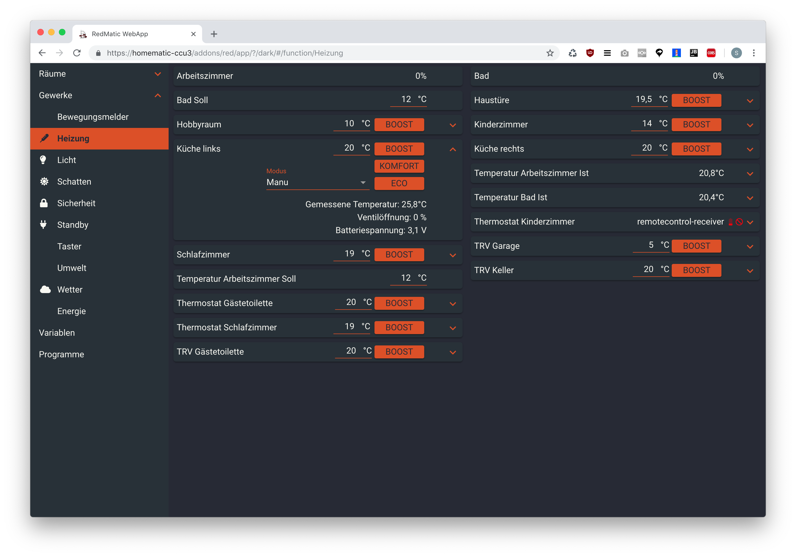
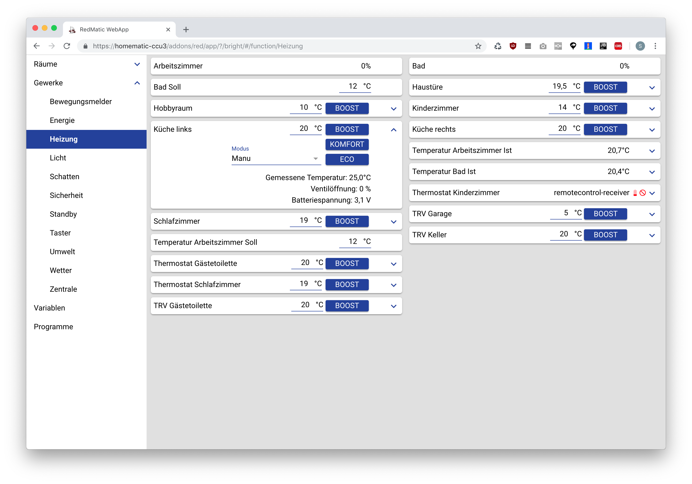

# WebApp

Die WebApp Node stellt ein einfaches responsives Dashboard aller Komponenten ohne weiter Konfiguration bereit.  
Es werden die Räume und Gewerke der CCU übernommen.

Um die WebApp zu verwenden muss die Node in einen beliebigen Flow-Tab platziert werden.
Nach einem Deployment ist sie unter `http://<your-ccu-address>/addons/red/app/?/app` aufrufbar.

